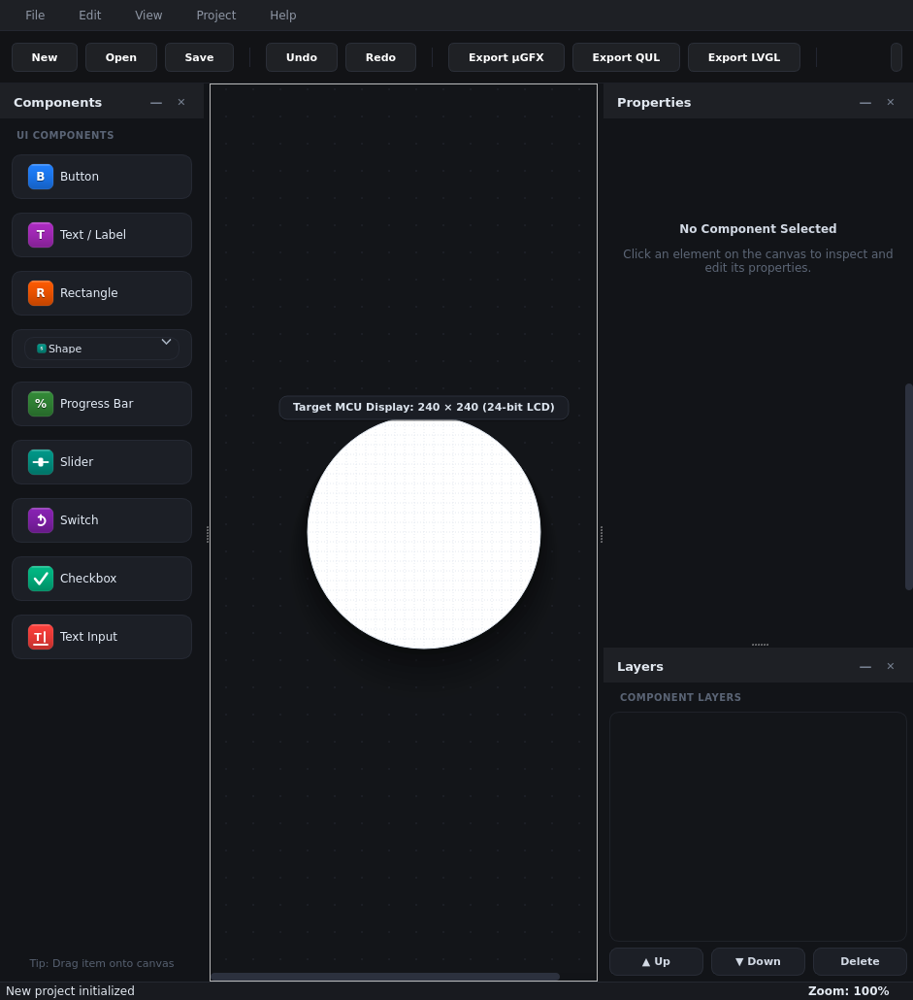
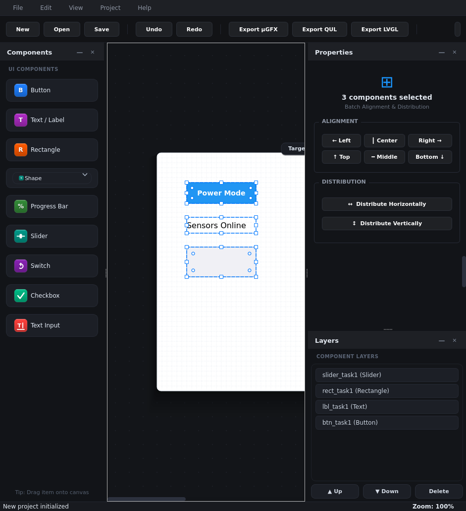
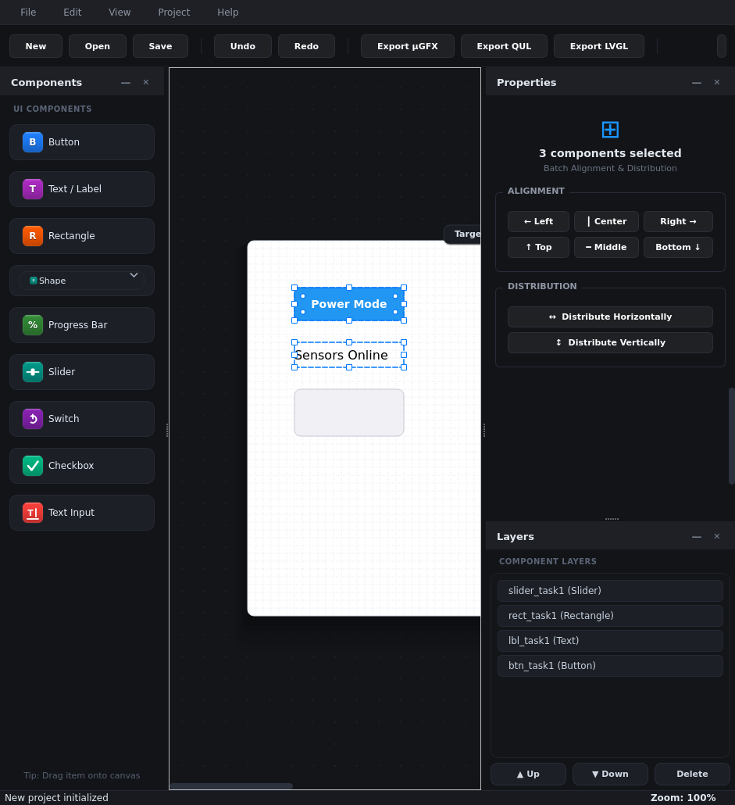
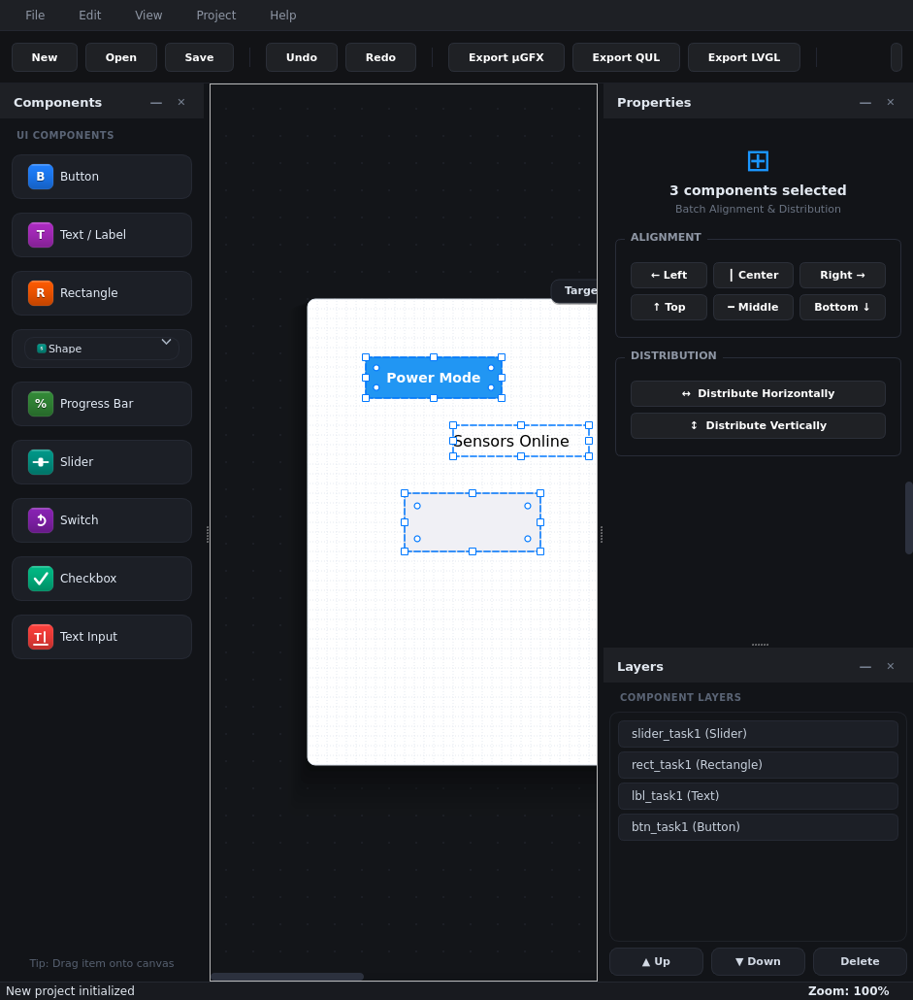
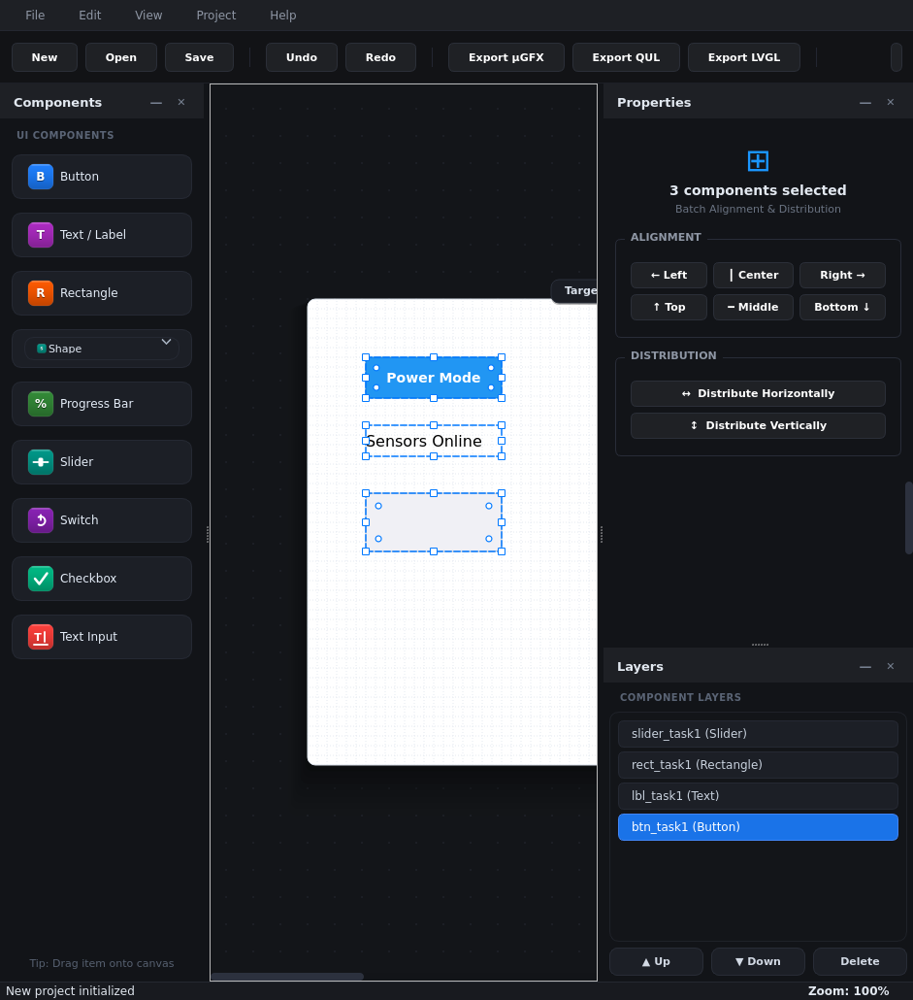
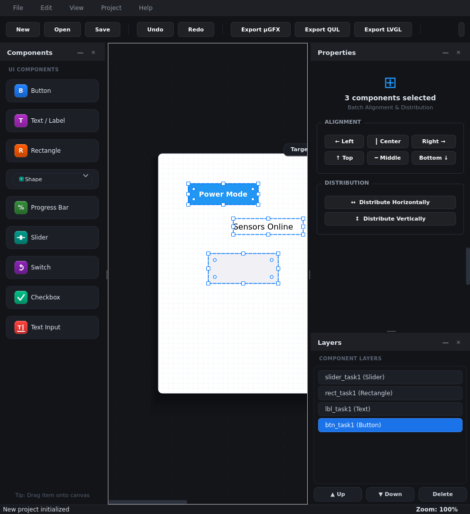
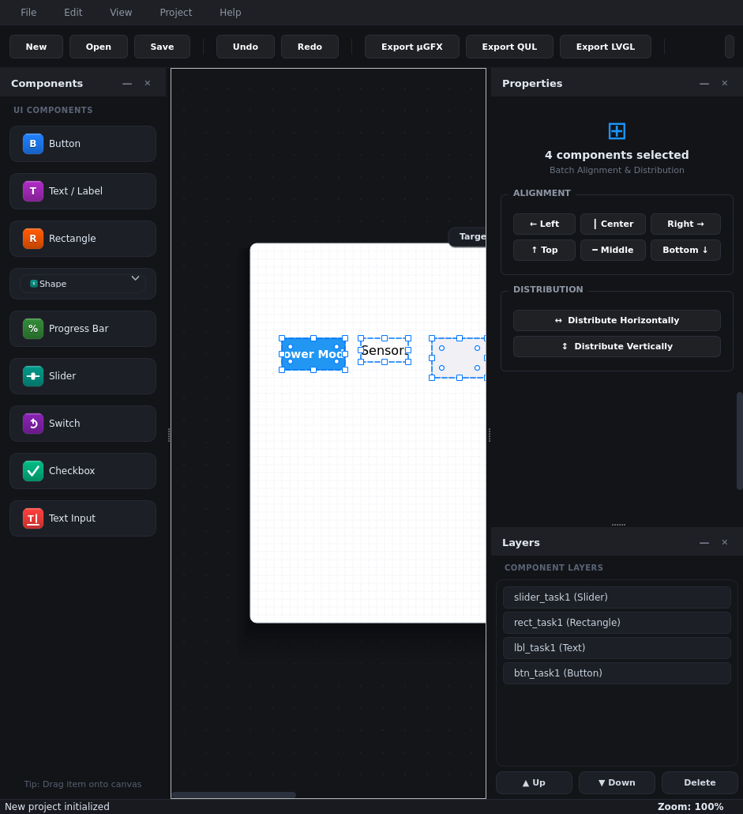
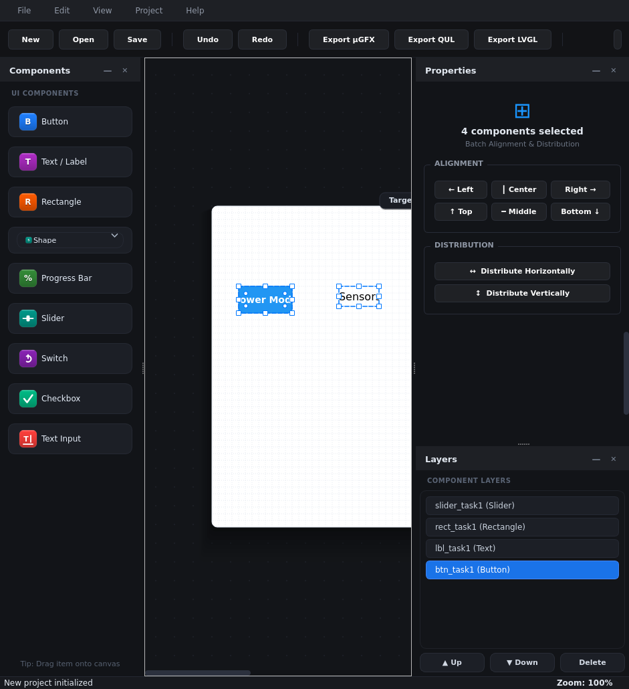

# Embedded UI Designer - Full Functional Validation Report

**Execution Date**: 2026-10-02T19:00:30 
**Overall Status**: **100% PASSED (ALL FUNCTIONS OPERATIONAL)** 
**Total Verified Functions**: 51 
**Total Execution Time**: 9048 ms

## Functional Verification Matrix

| Subsystem | Feature / Function | Status | Operational Details | Time |
| :--- | :--- | :---: | :--- | :---: |
| **UI Chrome** | Dock Panels Initialization | PASS | All dock panels and canvas subsystems loaded | 0ms |
| **UI Chrome** | Target Display Combo | PASS | Resolution presets initialized with 5 presets | 0ms |
| **Components** | Create Button | PASS | Added Button at (20,20), text='Power ON' | 0ms |
| **Components** | Create Label | PASS | Added Label text='Voltage: 3.3V', color=#00ffcc | 0ms |
| **Components** | Create Rectangle | PASS | Added Rectangle at (20,70) with cornerRadius=10 | 0ms |
| **Components** | Create Progress Bar | PASS | Added ProgressBar value=0.85, color=#10b981 | 0ms |
| **Components** | Create Slider | PASS | Added Slider value=65 | 0ms |
| **Components** | Create Switch | PASS | Added Switch state=CHECKED (true) | 0ms |
| **Components** | Create Checkbox | PASS | Added Checkbox text='SD Log', state=CHECKED | 0ms |
| **Components** | Create TextInput | PASS | Added TextInput text='ESP32_WiFi' | 0ms |
| **Components** | Create Circle | PASS | Added Circle diameter=24, color=#22c55e | 0ms |
| **Properties Panel** | Task 1 Regression Check | PASS | Switched Button->Label->ProgressBar->Button without editor stacking | 33ms |
| **Properties Panel** | Corner Radius Mutation | PASS | Adjusted corner radius from 10 to 16px | 7ms |
| **Color Picker** | RGB565 Computation | PASS | #1ECBE1 computes to exact 0x1E5C | 0ms |
| **Color Picker** | Complementary Harmony | PASS | Generated 2 swatches (Base #1ECBE1, Harmony #E1341E) | 14ms |
| **Color Picker** | Triadic Harmony | PASS | Generated 3 harmonious triadic swatches (+120, +240) | 5ms |
| **Color Picker** | Apply Swatch to Component | PASS | Applied chosen harmony color to Button background | 1ms |
| **Layer Panel** | Layer Synchronization | PASS | Layer count (9) matches canvas components | 0ms |
| **Layer Panel** | Layer Z-Order Move Up | PASS | Incremented component Z-order in layer stack | 1ms |
| **Canvas View** | Zoom In/Out/100% | PASS | Zoom verified: in > 100%, out < 100%, reset = 100% | 0ms |
| **Canvas View** | Target MCU Resolution Presets | PASS | Switched 480x320 -> 800x480 -> 320x240 smoothly | 0ms |
| **Canvas View** | Toggle Grid & Snap | PASS | Toggled Grid and Snap-to-Grid options | 0ms |
| **Edit Engine** | Duplicate & Undo/Redo | PASS | Duplicated item (+1), Undone (reverted), Redone (restored) | 7ms |
| **Project** | Save Project File (.euiproj) | PASS | Saved project (5382 bytes) to disk | 0ms |
| **Project** | Open Project File (.euiproj) | PASS | Loaded project successfully, restored 10 components | 2ms |
| **Exporter** | Export µGFX C Project | PASS | Generated complete µGFX project (ui.c, ui.h, gfxconf.h, main.c) | 0ms |
| **Exporter** | Export Qt for MCUs (QUL) | PASS | Generated Qt Quick Ultralite design.qml & project.qmlproject | 0ms |
| **Exporter** | Export LVGL C/C++ Project | PASS | Generated complete LVGL C/C++ project (ui.c, ui.h, lv_conf.h, main.c) | 0ms |
| **Canvas Resize** | Live Corner Resize Anchor | PASS | started=1, anchor=(100,100), size=170x105 | 15ms |
| **Canvas Resize** | Capture Held Resize | PASS | Saved the visible MainWindow while the resize mouse button was still held | 77ms |
| **Canvas Resize** | Shift Aspect Lock | PASS | Shift-modified corner drag preserved the original component aspect ratio | 89ms |
| **Shape Tool** | Capture Shape Flyout | PASS | Captured the open Shape flyout with all five options | 7966ms |
| **Shape Tool** | Select Custom Drawing Tool | PASS | Selecting Custom set the canvas active drawing tool | 7969ms |
| **Custom Shape** | Place and Finish Polygon | PASS | Three point clicks followed by Enter created and selected a closed PathComponent | 7985ms |
| **Custom Shape** | Path Stroke Properties | PASS | Properties panel exposes Stroke Color, Stroke Thickness, and Opacity | 7985ms |
| **Custom Shape** | Path JSON Round Trip | PASS | Path vertices, stroke color, thickness, and opacity survive JSON serialization | 7985ms |
| **Custom Shape** | Capture Drawn Path | PASS | Saved the selected stroked path with its inspector fields visible | 8051ms |
| **Custom Shape** | Escape Cancels Path | PASS | Escape removed the unfinished preview without adding a component | 8051ms |
| **Custom Shape** | Double-Click Finishes Path | PASS | Double-click closed a three-vertex polygon | 8053ms |
| **Shape Tool** | Rectangle Drag Draw | PASS | Rectangle menu selection created a canvas shape from a drag | 8055ms |
| **Round Display** | Create Round New Project | PASS | New Project dialog created a 240px round canvas at 24-bit depth | 8085ms |
| **Round Display** | Round Config JSON | PASS | The round display shape persists through DisplayConfig JSON | 8085ms |
| **Round Display** | Capture Circular Canvas | PASS | Captured the project canvas with its circular display boundary | 8147ms |
| **Validation** | Capture Window Screenshot | PASS | Captured 1920x1080 screenshot to /workspace/screenshots/functional_test_screenshot.png | 8217ms |
| **Task 1 Canvas Multi-Select** | Rubber-band Drag Select 3 Items | PASS | Rubber-band from (30,40) to (240,280) selected 3 items simultaneously | 16ms |
| **Task 1 Canvas Multi-Select** | Shift-Click Selection Building | PASS | Built selection of 3 components (Button, Label, Slider) via sequential Shift-clicks | 25ms |
| **Task 2 Properties Panel** | Multi-Select Clean State (No Overlap) | PASS | Properties panel displays '3 components selected' with zero individual fields | 2ms |
| **Task 3 Align Tools** | Align Left All to Min X (60) | PASS | All 3 items aligned to left bounding box X=60 with Y coords preserved | 12ms |
| **Task 3 Align Tools** | Single Compound Undo (Ctrl+Z) | PASS | Single Ctrl+Z undo atomically restored all 3 components to original staggered positions | 81ms |
| **Task 4 Distribute Tools** | Distribute Horizontally Equal Gaps (70px) | PASS | Outermost items fixed at 40 and 460; intermediate items spaced at exactly 70px gaps (40, 190, 320, 460) | 10ms |
| **Task 4 Distribute Tools** | Single Compound Undo (Ctrl+Z) | PASS | Single Ctrl+Z undo atomically restored all 4 components to original uneven positions | 78ms |

## Visual Verification Artifacts

- **Full Desktop Environment**: 
- **Task 1: Rubber-band Drag-Select**: 
- **Task 1: Shift-Click Sequential Select**: 
- **Task 2: Properties Panel Multi-Select State**: 
- **Task 3: Align Left (Before)**: 
- **Task 3: Align Left (After)**: 
- **Task 3: Align Left (Ctrl+Z Undo)**: 
- **Task 4: Distribute Horizontal (Before)**: 
- **Task 4: Distribute Horizontal (After)**: 
